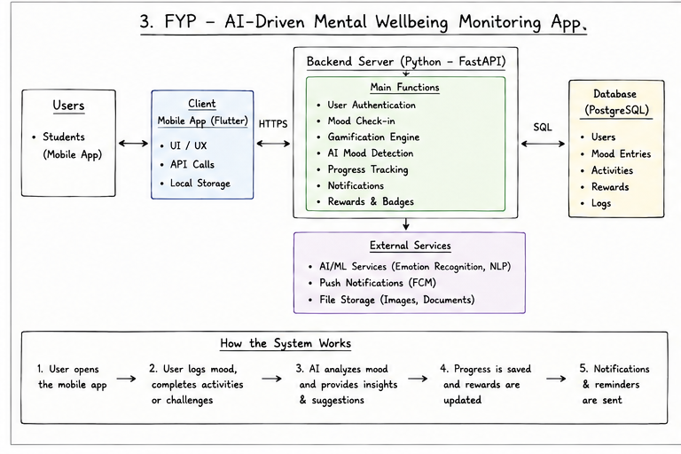

# AI-Driven Gamification for Personalized Wellbeing Monitoring

Final Year Project focused on AI-supported gamification and personalised wellbeing monitoring within a collaborative university mental-health application.

## Project Overview

The project explores how gamification and AI-assisted personalisation can be used to support continued engagement with digital mental wellbeing activities. The FYP module focuses on mood-based interaction, wellness activities, rewards, progress tracking and personalised feedback.

The wider university application was developed collaboratively by a team of student developers, with each developer contributing a specific feature or module.

## My FYP Focus

- Mood-based user interaction
- Gamified wellbeing activities
- Rewards and progress tracking
- AI-assisted personalised feedback
- Behaviour and engagement monitoring
- Integration of the FYP module with the wider application

## Tech Stack

- **Mobile Application:** Flutter, Dart
- **Backend:** Python, FastAPI
- **Database:** PostgreSQL
- **Integration:** REST APIs
- **AI / Personalisation:** AI/ML service integration

## Architecture

## Documentation

Additional project context is available in [`docs/project-overview.md`](docs/project-overview.md).

## Project Context

- **Project Type:** Bachelor of Computer Science (Honours) Final Year Project
- **University:** UCSI University
- **Development:** Individual FYP module within a collaborative university application
- **Platform:** Mobile application

## Repository Note

Environment secrets and private deployment configuration are not included in this repository.
